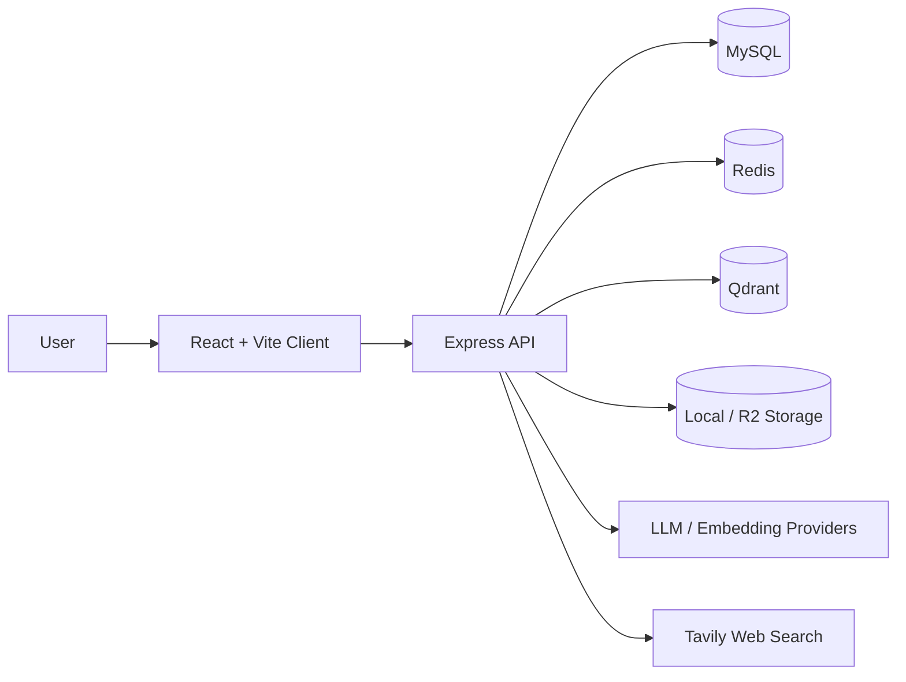

<div align="center">
  

  <h1>Groundpath / 溯知</h1>

  <p><strong>Trace the source. Reach the answer.</strong></p>

  <p>
    A traceable AI knowledge workspace for individuals and teams.
    <br />
    Turn documents, notes, and organizational memory into answers that are searchable, conversational, and verifiable.
  </p>

  <p>
    <code>React 19</code>
    <code>Express</code>
    <code>TypeScript</code>
    <code>MySQL</code>
    <code>Redis</code>
    <code>Qdrant</code>
    <code>Agentic RAG</code>
  </p>

  <p>
    <a href="./README.md">Chinese README</a>
    ·
    <a href="./docs/env-variables.md">Environment Variables</a>
    ·
    <a href="./docs/architecture-guardrails.md">Architecture Guardrails</a>
    ·
    <a href="./docs/user-hard-delete-design-2026-04-02.md">User Deletion Design</a>
  </p>
</div>

> Brand naming is now unified as `Groundpath / 溯知`. The repository name is `groundpath`, and the workspace scope is `@groundpath/*`.

## Product Overview

Groundpath is not a generic chat agent that only talks.

It is closer to a knowledge workspace designed around source traceability, semantic retrieval, and durable memory:

- Bring scattered documents into a unified knowledge base
- Build usable context through semantic retrieval and structured indexing
- Return answers with sources that can be traced back and verified
- Upgrade to Agentic RAG with tool use when the workflow requires it

<table>
  <tr>
    <td width="33%" valign="top">
      <strong>Searchable</strong>
      <br />
      Semantic retrieval, Structured RAG, document-scope filters, and vector fallback reduce the "the content exists but I still cannot find it" problem.
    </td>
    <td width="33%" valign="top">
      <strong>Conversational</strong>
      <br />
      Multi-turn chat, SSE streaming, message retry, and visible tool steps make answers interactive and the reasoning path inspectable.
    </td>
    <td width="33%" valign="top">
      <strong>Verifiable</strong>
      <br />
      Answers include source snippets and citation backtracking, so the goal is not just to sound right, but to be provable.
    </td>
  </tr>
</table>

## Core Capabilities

<table>
  <tr>
    <td width="50%" valign="top">
      <strong>Knowledge Base and Document Management</strong>
      <br />
      Knowledge base CRUD, document upload, version history, trash, restore, permanent delete, and folder-tree organization.
    </td>
    <td width="50%" valign="top">
      <strong>RAG and Agentic RAG</strong>
      <br />
      Document chunking, embeddings, Qdrant retrieval, Structured RAG rollout, tool calling, and web search.
    </td>
  </tr>
  <tr>
    <td width="50%" valign="top">
      <strong>Document AI</strong>
      <br />
      Document summary, hierarchical long-form summary, structured analysis, content generation, expansion, and optional VLM image descriptions.
    </td>
    <td width="50%" valign="top">
      <strong>Enterprise-Ready Foundations</strong>
      <br />
      OAuth, email verification, session management, logging, Swagger, scheduled jobs, and graceful shutdown.
    </td>
  </tr>
</table>

## Three-Step Workflow

1. Create a knowledge base and define a maintainable boundary for a topic.
2. Import documents and let the system parse, chunk, embed, and index them automatically.
3. Enter chat or agent mode to get answers with traceable citations.

## Architecture At A Glance



The repository is organized as a `pnpm` monorepo:

- `packages/client`: React + Vite frontend for the console, knowledge bases, chat, and document interactions
- `packages/server`: Express + TypeScript backend for APIs, RAG orchestration, jobs, auth, and logging
- `packages/shared`: shared types, constants, Zod contracts, and utility functions

## Tech Stack

| Layer           | Stack                                                       |
| --------------- | ----------------------------------------------------------- |
| Frontend        | React 19, Vite, TanStack Router, TanStack Query, i18next    |
| Backend         | Express, TypeScript, Drizzle ORM, BullMQ, Pino              |
| Data and Cache  | MySQL, Redis, Qdrant                                        |
| AI Capabilities | OpenAI, Anthropic, Zhipu, DeepSeek, Ollama, Custom Provider |
| Storage         | Local, Cloudflare R2                                        |
| Operations      | Docker Compose, Swagger, GitHub Actions                     |

## Quick Start

### Option A: Docker Compose

Shortest path:

1. Create a `.env` file in the repository root.
2. Fill in the required values from the example below.
3. Run `pnpm docker:up`.

```dotenv
CLIENT_PORT=18080
FRONTEND_URL=http://localhost:18080

MYSQL_ROOT_PASSWORD=change-me-root-password
MYSQL_DATABASE=groundpath
MYSQL_USER=groundpath
MYSQL_PASSWORD=change-me-app-password

JWT_SECRET=change-me-jwt-secret-at-least-32-chars
ENCRYPTION_KEY=change-me-encryption-key-at-least-32-chars
EMAIL_VERIFICATION_SECRET=change-me-email-verification-secret

EMBEDDING_PROVIDER=zhipu
ZHIPU_API_KEY=change-me-zhipu-api-key
```

If you change `CLIENT_PORT`, update `FRONTEND_URL` to match.

Default URLs after startup:

- Frontend entrypoint: `http://localhost:18080`
- Backend API (via the `client` reverse proxy): `http://localhost:18080/api`
- Swagger: `http://localhost:18080/api-docs`
- Health check: `http://localhost:18080/health/live`

Docker Compose notes:

- `mysql`, `redis`, `qdrant`, and `server` stay on the internal Compose network and are not published to the host
- `client` is the only host-facing entrypoint and acts as the reverse proxy
- The boot flow runs database migrations first and starts `server` only after the migration job completes successfully
- `packages/server/Dockerfile` and `packages/client/Dockerfile` live with their services; the `docker/` directory only stores infrastructure assets such as the Nginx template

### Option B: Local Development

```bash
pnpm install
Copy-Item packages/server/.env.example packages/server/.env
pnpm -F @groundpath/server db:push
pnpm dev
```

Default development URLs:

- Frontend: `http://localhost:5173`
- Backend: `http://localhost:3000`

<details>
<summary>Minimum bootstrapping configuration</summary>

- `DATABASE_URL`
- `REDIS_URL`
- `JWT_SECRET`
- `ENCRYPTION_KEY`
- `EMAIL_VERIFICATION_SECRET`
- `QDRANT_URL`
- The API key for the selected `EMBEDDING_PROVIDER` (for example `ZHIPU_API_KEY` or `OPENAI_API_KEY`)

</details>

<details>
<summary>Common optional configuration</summary>

- `TAVILY_API_KEY`
- `STORAGE_TYPE=local|r2`
- `STRUCTURED_RAG_ENABLED`
- `STRUCTURED_RAG_ROLLOUT_MODE`
- `IMAGE_DESCRIPTION_ENABLED`

Conditionally required configuration:

- `OPENAI_API_KEY`: required when `EMBEDDING_PROVIDER=openai`
- `ZHIPU_API_KEY`: required when `EMBEDDING_PROVIDER=zhipu`
- `VLM_API_KEY`: required when `IMAGE_DESCRIPTION_ENABLED=true`

</details>

For full server-side configuration details, see [docs/env-variables.md](./docs/env-variables.md) and [packages/server/.env.example](./packages/server/.env.example). When using Docker Compose, the root `.env` file also needs the orchestration variables `CLIENT_PORT` and `MYSQL_*`.

## Common Commands

| Command                                     | Purpose                                                 |
| ------------------------------------------- | ------------------------------------------------------- |
| `pnpm dev`                                  | Start frontend and backend development servers together |
| `pnpm build`                                | Build the entire monorepo                               |
| `pnpm test`                                 | Run tests                                               |
| `pnpm lint`                                 | Run ESLint                                              |
| `pnpm architecture:check`                   | Validate backend module boundaries                      |
| `pnpm -F @groundpath/server db:push`        | Sync schema for development                             |
| `pnpm -F @groundpath/server db:migrate`     | Run production migrations                               |
| `pnpm -F @groundpath/server db:drift-check` | Check schema and migration consistency                  |

## Engineering Constraints

This repository has a high bar for consistency and long-term maintainability. A few key rules:

- Prefer orchestrating multi-step business flows inside a single service, and keep side effects paired and idempotent
- All counters and statistics must enforce floor protection so values never go negative
- Queues and background jobs must tolerate repeated execution without double-counting
- Cross-module reuse should go through `public/*` exports instead of new deep imports
- Run `pnpm architecture:check` before submitting backend module-boundary changes

See [AGENTS.md](./AGENTS.md) and [docs/architecture-guardrails.md](./docs/architecture-guardrails.md) for the full ruleset.

## Repository Structure

```text
.
├─ packages/
│  ├─ client/   # React + Vite frontend (includes packages/client/Dockerfile)
│  ├─ server/   # Express + TypeScript backend (includes packages/server/Dockerfile)
│  └─ shared/   # Shared types, constants, and Zod contracts
├─ docker/
│  └─ nginx/    # Runtime infrastructure config such as the Nginx template
├─ docs/
│  ├─ env-variables.md
│  ├─ architecture-guardrails.md
│  └─ user-hard-delete-design-2026-04-02.md
├─ docker-compose.yml
└─ package.json
```

## Related Docs

- [docs/env-variables.md](./docs/env-variables.md): Environment variable reference
- [docs/architecture-guardrails.md](./docs/architecture-guardrails.md): Architecture boundaries and guardrails
- [docs/user-hard-delete-design-2026-04-02.md](./docs/user-hard-delete-design-2026-04-02.md): Active design note for full user hard deletion

## Current Status

- Product branding and technical naming are unified as `Groundpath / 溯知`
- Repository name has been updated to `groundpath`
- Workspace package scope has been updated to `@groundpath/*`
