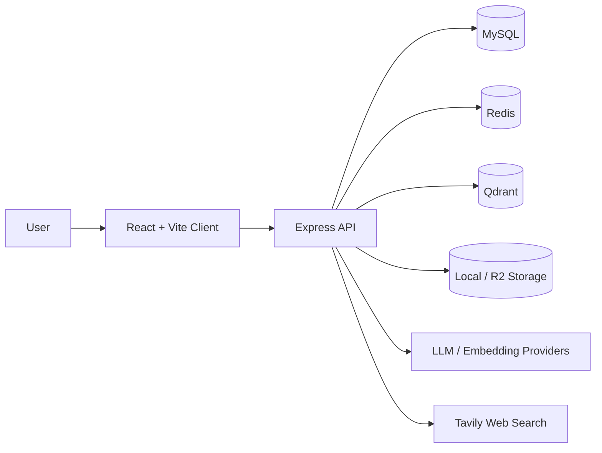

<div align="center">
  

  <h1>溯知 / Groundpath</h1>

  <p><strong>溯源而知，一问即达</strong></p>

  <p>
    面向个人与团队的可追溯 AI 知识工作台。
    <br />
    把文档、笔记与组织记忆沉淀成可检索、可对话、可验证的答案系统。
  </p>

  <p>
    <code>React 19</code>
    <code>Express</code>
    <code>TypeScript</code>
    <code>MySQL</code>
    <code>Redis</code>
    <code>Qdrant</code>
    <code>Agentic RAG</code>
  </p>

  <p>
    <a href="./README.en.md">English README</a>
    ·
    <a href="./docs/env-variables.md">环境变量</a>
    ·
    <a href="./docs/architecture-guardrails.md">架构门禁</a>
    ·
    <a href="./docs/codebase-analysis.md">代码分析</a>
  </p>
</div>

> 品牌信息已统一为 `溯知 / Groundpath`，仓库名为 `groundpath`，workspace scope 为 `@groundpath/*`。

## 产品一览

溯知不是一个只会聊天的通用 Agent。

它更像一个围绕「来源、语义、记忆」设计的知识工作台：

- 把零散文档接入统一知识库
- 通过语义检索和结构化索引建立可用上下文
- 让回答自带来源、可回查、可验证
- 在需要时升级到带工具调用的 Agentic RAG

<table>
  <tr>
    <td width="33%" valign="top">
      <strong>可检索</strong>
      <br />
      语义检索、Structured RAG、文档范围过滤、向量回退，减少“明明有内容却找不到”的情况。
    </td>
    <td width="33%" valign="top">
      <strong>可对话</strong>
      <br />
      多轮会话、SSE 流式响应、消息重试、工具调用过程展示，既能问答也能追踪推理链路。
    </td>
    <td width="33%" valign="top">
      <strong>可验证</strong>
      <br />
      回答附带来源片段与引用回溯，重点不是“像答案”，而是“能被证实”。
    </td>
  </tr>
</table>

## 核心能力

<table>
  <tr>
    <td width="50%" valign="top">
      <strong>知识库与文档管理</strong>
      <br />
      知识库 CRUD、文档上传、版本历史、回收站、恢复、永久删除、目录树组织。
    </td>
    <td width="50%" valign="top">
      <strong>RAG 与 Agentic RAG</strong>
      <br />
      文档分块、向量化、Qdrant 检索、Structured RAG rollout、工具调用与网络搜索。
    </td>
  </tr>
  <tr>
    <td width="50%" valign="top">
      <strong>Document AI</strong>
      <br />
      文档摘要、长文分层摘要、结构化分析、内容生成、扩写、可选 VLM 图像描述。
    </td>
    <td width="50%" valign="top">
      <strong>企业级基础能力</strong>
      <br />
      OAuth、邮箱验证码、会话管理、日志体系、Swagger、定时任务、优雅停机。
    </td>
  </tr>
</table>

## 三步工作流

1. 创建知识库，按主题建立可维护的内容边界。
2. 导入文档，自动完成解析、分块、向量化和结构化索引。
3. 进入问答或 Agent 模式，获取带引用来源的答案。

## 架构速览



仓库采用 `pnpm` monorepo：

- `packages/client`：React + Vite 前端，负责控制台、知识库、聊天、文档交互
- `packages/server`：Express + TypeScript 后端，负责 API、RAG 编排、任务、鉴权、日志
- `packages/shared`：前后端共享类型、常量、Zod 契约与工具函数

## 技术栈

| 层         | 方案                                                        |
| ---------- | ----------------------------------------------------------- |
| 前端       | React 19、Vite、TanStack Router、TanStack Query、i18next    |
| 后端       | Express、TypeScript、Drizzle ORM、BullMQ、Pino              |
| 数据与缓存 | MySQL、Redis、Qdrant                                        |
| AI 能力    | OpenAI、Anthropic、Zhipu、DeepSeek、Ollama、Custom Provider |
| 存储       | Local、Cloudflare R2                                        |
| 运维       | Docker Compose、Swagger、GitHub Actions                     |

## 快速启动

### 方式 A：Docker Compose

最短路径：

1. 在仓库根目录创建 `.env`
2. 参考下面示例填入必填值
3. 运行 `pnpm docker:up`

```dotenv
CLIENT_PORT=18080
FRONTEND_URL=http://localhost:18080

MYSQL_ROOT_PASSWORD=change-me-root-password
MYSQL_DATABASE=groundpath
MYSQL_USER=groundpath
MYSQL_PASSWORD=change-me-app-password

JWT_SECRET=change-me-jwt-secret-at-least-32-chars
ENCRYPTION_KEY=change-me-encryption-key-at-least-32-chars
EMAIL_VERIFICATION_SECRET=change-me-email-verification-secret

EMBEDDING_PROVIDER=zhipu
ZHIPU_API_KEY=change-me-zhipu-api-key
```

如果修改 `CLIENT_PORT`，同步修改 `FRONTEND_URL`。

启动后默认地址：

- 前端入口：`http://localhost:18080`
- 后端 API（经 `client` 反向代理）：`http://localhost:18080/api`
- Swagger：`http://localhost:18080/api-docs`
- 健康检查：`http://localhost:18080/health/live`

Docker Compose 说明：

- `mysql` / `redis` / `qdrant` / `server` 默认只在 Compose 内网暴露，不再映射宿主机端口
- `client` 是唯一对宿主机开放的入口，用作统一入口和反向代理
- 启动流程会先执行一次数据库迁移，迁移成功后才拉起 `server`

国内机房如需访问 Google OAuth、OpenAI 等海外服务，可在根目录 `.env` 为 `server` 容器增加出站代理：

```dotenv
HTTP_PROXY=http://your-proxy-host:port
HTTPS_PROXY=http://your-proxy-host:port
NO_PROXY=localhost,127.0.0.1,::1,mysql,redis,qdrant,server,client
NODE_USE_ENV_PROXY=1
```

说明：

- 这些变量会透传到 `server` 容器，用于 Node.js 内置 `fetch()` / `http(s)` 客户端代理出站
- `NO_PROXY` 至少保留本机与 Compose 内部服务名，避免健康检查和内网请求被错误转发
- 变更后需重建 `server` 容器使新的 Node 运行环境生效：`docker compose up -d --build server`
- 若 `docker compose exec server node -v` 小于 `v22.21.0`，请先重建镜像拉取较新的 `node:22-alpine`

验证方式：

```bash
docker compose exec server node -e "fetch('https://oauth2.googleapis.com/token',{method:'POST'}).then(r=>console.log('status',r.status)).catch(console.error)"
```

如代理生效，这条命令应快速返回一个 HTTP 状态码（通常是 `400`），而不是 `ETIMEDOUT`。

### 方式 B：本地开发

```bash
pnpm install
Copy-Item packages/server/.env.example packages/server/.env
pnpm -F @groundpath/server db:push
pnpm dev
```

默认开发地址：

- 前端：`http://localhost:5173`
- 后端：`http://localhost:3000`

<details>
<summary>最低可启动配置</summary>

- `DATABASE_URL`
- `REDIS_URL`
- `JWT_SECRET`
- `ENCRYPTION_KEY`
- `EMAIL_VERIFICATION_SECRET`
- `QDRANT_URL`
- `EMBEDDING_PROVIDER` 对应的 provider key（如 `ZHIPU_API_KEY` 或 `OPENAI_API_KEY`）

</details>

<details>
<summary>常见可选配置</summary>

- `TAVILY_API_KEY`
- `STORAGE_TYPE=local|r2`
- `STRUCTURED_RAG_ENABLED`
- `STRUCTURED_RAG_ROLLOUT_MODE`
- `IMAGE_DESCRIPTION_ENABLED`

条件必填配置：

- `OPENAI_API_KEY`：当 `EMBEDDING_PROVIDER=openai` 时必填
- `ZHIPU_API_KEY`：当 `EMBEDDING_PROVIDER=zhipu` 时必填
- `VLM_API_KEY`：当 `IMAGE_DESCRIPTION_ENABLED=true` 时必填

</details>

更完整的服务端配置说明见 [docs/env-variables.md](./docs/env-variables.md) 和 [packages/server/.env.example](./packages/server/.env.example)。使用 Docker Compose 时，还需要在根目录 `.env` 中提供 `CLIENT_PORT` 与 `MYSQL_*` 这组编排变量。

## 常用命令

| 命令                                        | 用途                     |
| ------------------------------------------- | ------------------------ |
| `pnpm dev`                                  | 同时启动前后端开发环境   |
| `pnpm build`                                | 构建整个 monorepo        |
| `pnpm test`                                 | 运行测试                 |
| `pnpm lint`                                 | 运行 ESLint              |
| `pnpm architecture:check`                   | 检查后端模块边界         |
| `pnpm -F @groundpath/server db:push`        | 开发环境同步 schema      |
| `pnpm -F @groundpath/server db:migrate`     | 生产环境执行迁移         |
| `pnpm -F @groundpath/server db:drift-check` | 校验 schema 与迁移一致性 |

## 工程约束

这个仓库对一致性和长期可维护性要求比较高，几个关键约束如下：

- 多步业务流程优先在单一 service 中编排，副作用必须成对且幂等
- 计数器与统计更新必须带 floor 保护，禁止出现负数
- 队列与后台任务必须支持重复执行而不重复计数
- 跨模块复用默认通过 `public/*` 出口，不新增 deep import
- 后端模块边界相关改动提交前，至少执行 `pnpm architecture:check`

详细规则见 [AGENTS.md](./AGENTS.md) 与 [docs/architecture-guardrails.md](./docs/architecture-guardrails.md)。

## 仓库结构

```text
.
├─ packages/
│  ├─ client/   # React + Vite 前端
│  ├─ server/   # Express + TypeScript 后端
│  └─ shared/   # 共享类型、常量、Zod 契约
├─ docs/
│  ├─ env-variables.md
│  ├─ architecture-guardrails.md
│  ├─ codebase-analysis.md
│  └─ codebase-analysis-2026-03-23.md
├─ docker-compose.yml
└─ package.json
```

## 相关文档

- [docs/env-variables.md](./docs/env-variables.md)：环境变量总览
- [docs/architecture-guardrails.md](./docs/architecture-guardrails.md)：架构边界与门禁
- [docs/codebase-analysis.md](./docs/codebase-analysis.md)：代码库分析稳定入口（最新报告与归档）

## 当前状态

- 产品品牌与技术命名已统一为 `溯知 / Groundpath`
- 仓库名已切换为 `groundpath`
- workspace 包作用域已切换为 `@groundpath/*`
