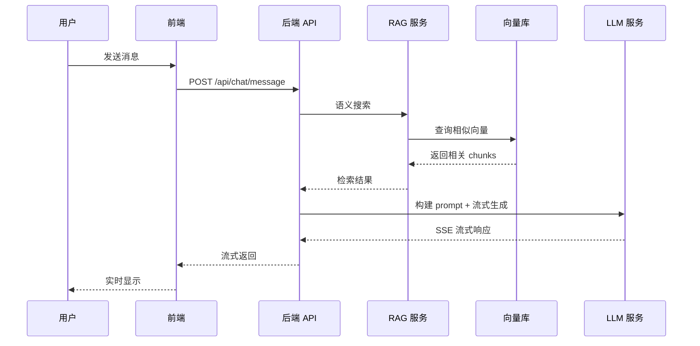

# AI 功能规划文档

> Knowledge Agent AI 核心功能设计与实现规划

## 目录

- [概述](#概述)
- [现有架构分析](#现有架构分析)
- [功能一：AI 聊天](#功能一ai-聊天)
- [功能二：AI 模型配置](#功能二ai-模型配置)
- [功能三：AI 阅读文档](#功能三ai-阅读文档)
- [功能四：AI 生成文档](#功能四ai-生成文档)
- [数据库设计](#数据库设计)
- [API 设计](#api-设计)
- [前端组件设计](#前端组件设计)
- [实现优先级](#实现优先级)

---

## 概述

本文档规划 Knowledge Agent 的四大 AI 核心功能：

| 功能        | 描述                  | 依赖          |
| ----------- | --------------------- | ------------- |
| AI 聊天     | 基于知识库的 RAG 对话 | 向量搜索、LLM |
| AI 模型配置 | 多模型管理与切换      | 无            |
| AI 阅读文档 | 智能文档总结与问答    | 文档模块、LLM |
| AI 生成文档 | AI 辅助内容创作       | LLM           |

---

## 现有架构分析

### 后端模块结构

```
packages/server/src/modules/
├── auth/           # 认证 (JWT/OAuth)
├── user/           # 用户管理
├── document/       # 文档 CRUD、版本、文件夹
├── knowledge-base/ # 知识库管理
├── embedding/      # 嵌入服务 (zhipu/openai/ollama)
├── vector/         # Qdrant 向量存储
├── rag/            # 文档处理、分块、语义搜索
├── storage/        # 文件存储 (local/R2)
└── logs/           # 操作日志
```

### 现有能力

- **文档管理**：上传、版本控制、文件夹组织
- **知识库**：创建、配置嵌入模型、文档关联
- **嵌入服务**：支持 zhipu、openai、ollama 三种提供者
- **向量搜索**：Qdrant 集成，支持语义检索
- **文本分块**：自动段落/句子切分，可配置 chunk size 和 overlap

### 需要新增

- **LLM 服务模块**：接入大语言模型
- **对话模块**：会话管理、消息流
- **AI 配置模块**：模型参数管理

---

## 功能一：AI 聊天

### 功能描述

基于知识库的 RAG (检索增强生成) 对话系统，用户可以与知识库进行自然语言交互。

### 核心流程

```
用户提问 → 向量检索相关文档 → 构建 Prompt → LLM 生成回答 → 返回响应
```

### 详细流程



### 后端设计

#### 模块结构

```
packages/server/src/modules/chat/
├── index.ts
├── chat.router.ts
├── controllers/
│   └── chat.controller.ts
├── services/
│   ├── chat.service.ts          # 对话编排
│   ├── message.service.ts       # 消息管理
│   └── prompt.service.ts        # Prompt 构建
├── repositories/
│   ├── conversation.repository.ts
│   └── message.repository.ts
└── types/
    └── chat.types.ts
```

#### 核心服务

```typescript
// chat.service.ts
export const chatService = {
  /**
   * 处理用户消息并生成 AI 响应
   */
  async chat(options: ChatOptions): Promise<AsyncGenerator<string>> {
    const { userId, conversationId, message, knowledgeBaseId } = options;

    // 1. 检索相关文档
    const relevantChunks = await searchService.searchInKnowledgeBase({
      userId,
      knowledgeBaseId,
      query: message,
      limit: 5,
      scoreThreshold: 0.7,
    });

    // 2. 构建上下文
    const context = promptService.buildContext(relevantChunks);

    // 3. 构建完整 prompt
    const prompt = promptService.buildChatPrompt({
      systemPrompt: '你是一个智能助手...',
      context,
      history: await messageService.getHistory(conversationId),
      userMessage: message,
    });

    // 4. 调用 LLM 流式生成
    return llmService.streamGenerate(prompt);
  },
};
```

#### Prompt 模板

```typescript
// prompt.service.ts
export const promptService = {
  buildChatPrompt(options: PromptOptions): string {
    const { systemPrompt, context, history, userMessage } = options;

    return `${systemPrompt}

## 参考资料
${context}

## 对话历史
${history.map((m) => `${m.role}: ${m.content}`).join('\n')}

## 用户问题
${userMessage}

请基于参考资料回答用户问题。如果参考资料中没有相关信息，请如实告知。`;
  },

  buildContext(chunks: SearchResult[]): string {
    return chunks.map((chunk, i) => `[${i + 1}] ${chunk.content}`).join('\n\n');
  },
};
```

### 前端设计

#### 组件结构

```
packages/client/src/
├── routes/
│   └── chat.route.tsx           # 聊天页面路由
├── components/
│   └── chat/
│       ├── ChatContainer.tsx    # 聊天容器
│       ├── ChatInput.tsx        # 输入框
│       ├── ChatMessage.tsx      # 消息气泡
│       ├── ChatHistory.tsx      # 历史会话列表
│       ├── SourceCard.tsx       # 引用来源卡片
│       └── StreamingText.tsx    # 流式文本渲染
├── hooks/
│   └── useChat.ts               # 聊天 Hook
└── stores/
    └── chatStore.ts             # 聊天状态管理
```

#### 状态管理

```typescript
// stores/chatStore.ts
interface ChatState {
  conversations: Conversation[];
  activeConversationId: string | null;
  messages: Message[];
  isStreaming: boolean;
  selectedKnowledgeBaseId: string | null;
}

export const useChatStore = create<ChatState>((set, get) => ({
  conversations: [],
  activeConversationId: null,
  messages: [],
  isStreaming: false,
  selectedKnowledgeBaseId: null,

  sendMessage: async (content: string) => {
    set({ isStreaming: true });

    // 添加用户消息
    const userMessage = { role: 'user', content };
    set((state) => ({ messages: [...state.messages, userMessage] }));

    // 流式获取 AI 响应
    const response = await chatApi.sendMessage({
      conversationId: get().activeConversationId,
      knowledgeBaseId: get().selectedKnowledgeBaseId,
      message: content,
    });

    // 处理 SSE 流
    for await (const chunk of response) {
      set((state) => ({
        messages: updateLastAssistantMessage(state.messages, chunk),
      }));
    }

    set({ isStreaming: false });
  },
}));
```

#### 聊天界面

```tsx
// components/chat/ChatContainer.tsx
export function ChatContainer() {
  const { messages, isStreaming, sendMessage } = useChatStore();
  const [input, setInput] = useState('');

  const handleSend = () => {
    if (!input.trim() || isStreaming) return;
    sendMessage(input);
    setInput('');
  };

  return (
    <div className="flex flex-col h-full">
      {/* 消息列表 */}
      <div className="flex-1 overflow-y-auto p-4 space-y-4">
        {messages.map((msg, i) => (
          <ChatMessage key={i} message={msg} />
        ))}
      </div>

      {/* 输入区域 */}
      <div className="border-t p-4">
        <ChatInput value={input} onChange={setInput} onSend={handleSend} disabled={isStreaming} />
      </div>
    </div>
  );
}
```

### 功能特性

| 特性       | 描述                 | 优先级 |
| ---------- | -------------------- | ------ |
| 基础对话   | 单轮问答             | P0     |
| 流式响应   | SSE 实时输出         | P0     |
| 知识库选择 | 选择对话的知识库范围 | P0     |
| 对话历史   | 多轮对话上下文       | P0     |
| 引用来源   | 显示回答的文档来源   | P1     |
| 会话管理   | 新建/删除/重命名会话 | P1     |
| 消息反馈   | 点赞/点踩反馈        | P2     |
| 导出对话   | 导出为 Markdown/PDF  | P2     |

---

## 功能二：AI 模型配置

### 功能描述

统一管理 LLM 和 Embedding 模型的配置，支持多提供商、多模型切换。

### 支持的模型提供商

#### LLM 提供商

| 提供商    | 模型示例                       | 特点                 |
| --------- | ------------------------------ | -------------------- |
| OpenAI    | gpt-4o, gpt-4o-mini            | 性能强，成本较高     |
| Anthropic | claude-3-opus, claude-3-sonnet | 长上下文，安全性好   |
| 智谱 AI   | glm-4, glm-4-flash             | 中文优化，国内可用   |
| DeepSeek  | deepseek-chat, deepseek-coder  | 性价比高，代码能力强 |
| Ollama    | llama3, qwen2                  | 本地部署，隐私安全   |

#### Embedding 提供商 (已有)

| 提供商  | 模型                   | 维度 |
| ------- | ---------------------- | ---- |
| OpenAI  | text-embedding-3-small | 1536 |
| 智谱 AI | embedding-2            | 1024 |
| Ollama  | nomic-embed-text       | 768  |

### 后端设计

#### 模块结构

```
packages/server/src/modules/llm/
├── index.ts
├── llm.router.ts
├── controllers/
│   └── llm.controller.ts
├── services/
│   └── llm.service.ts
├── providers/
│   ├── base.provider.ts         # 抽象基类
│   ├── openai.provider.ts
│   ├── anthropic.provider.ts
│   ├── zhipu.provider.ts
│   ├── deepseek.provider.ts
│   └── ollama.provider.ts
└── types/
    └── llm.types.ts
```

#### 提供商抽象

```typescript
// providers/base.provider.ts
export interface LLMProvider {
  name: string;

  /**
   * 普通生成
   */
  generate(prompt: string, options?: GenerateOptions): Promise<string>;

  /**
   * 流式生成
   */
  streamGenerate(prompt: string, options?: GenerateOptions): AsyncGenerator<string>;

  /**
   * 检查可用性
   */
  healthCheck(): Promise<boolean>;
}

export interface GenerateOptions {
  model?: string;
  temperature?: number;
  maxTokens?: number;
  topP?: number;
  stop?: string[];
}
```

#### OpenAI 提供商实现

```typescript
// providers/openai.provider.ts
import OpenAI from 'openai';

export class OpenAIProvider implements LLMProvider {
  name = 'openai';
  private client: OpenAI;

  constructor(apiKey: string, baseUrl?: string) {
    this.client = new OpenAI({
      apiKey,
      baseURL: baseUrl,
    });
  }

  async *streamGenerate(prompt: string, options?: GenerateOptions): AsyncGenerator<string> {
    const stream = await this.client.chat.completions.create({
      model: options?.model ?? 'gpt-4o-mini',
      messages: [{ role: 'user', content: prompt }],
      temperature: options?.temperature ?? 0.7,
      max_tokens: options?.maxTokens ?? 2048,
      stream: true,
    });

    for await (const chunk of stream) {
      const content = chunk.choices[0]?.delta?.content;
      if (content) yield content;
    }
  }

  async generate(prompt: string, options?: GenerateOptions): Promise<string> {
    const chunks: string[] = [];
    for await (const chunk of this.streamGenerate(prompt, options)) {
      chunks.push(chunk);
    }
    return chunks.join('');
  }

  async healthCheck(): Promise<boolean> {
    try {
      await this.client.models.list();
      return true;
    } catch {
      return false;
    }
  }
}
```

#### 模型配置服务

```typescript
// services/llm.service.ts
export const llmService = {
  /**
   * 获取用户的 LLM 配置
   */
  async getUserConfig(userId: string): Promise<LLMConfig> {
    const config = await llmConfigRepository.findByUser(userId);
    return config ?? getDefaultConfig();
  },

  /**
   * 更新用户的 LLM 配置
   */
  async updateConfig(userId: string, config: UpdateLLMConfigRequest): Promise<LLMConfig> {
    // 验证 API Key 有效性
    const provider = this.getProvider(config.provider, config.apiKey);
    const isValid = await provider.healthCheck();

    if (!isValid) {
      throw Errors.validation('Invalid API key or provider configuration');
    }

    return llmConfigRepository.upsert(userId, config);
  },

  /**
   * 获取提供商实例
   */
  getProvider(providerType: LLMProviderType, apiKey: string): LLMProvider {
    switch (providerType) {
      case 'openai':
        return new OpenAIProvider(apiKey);
      case 'anthropic':
        return new AnthropicProvider(apiKey);
      case 'zhipu':
        return new ZhipuProvider(apiKey);
      case 'deepseek':
        return new DeepSeekProvider(apiKey);
      case 'ollama':
        return new OllamaProvider();
      default:
        throw Errors.validation(`Unknown provider: ${providerType}`);
    }
  },
};
```

### 前端设计

#### 配置界面

```
packages/client/src/
├── routes/
│   └── settings.ai.route.tsx     # AI 设置页面
├── components/
│   └── settings/
│       ├── AISettings.tsx        # AI 设置容器
│       ├── LLMProviderCard.tsx   # 提供商配置卡片
│       ├── ModelSelector.tsx     # 模型选择器
│       └── APIKeyInput.tsx       # API Key 输入
└── hooks/
    └── useAISettings.ts
```

#### 设置界面

```tsx
// components/settings/AISettings.tsx
export function AISettings() {
  const { config, updateConfig, testConnection } = useAISettings();
  const [provider, setProvider] = useState(config.provider);
  const [apiKey, setApiKey] = useState('');
  const [model, setModel] = useState(config.model);

  const providers = [
    { id: 'openai', name: 'OpenAI', models: ['gpt-4o', 'gpt-4o-mini'] },
    { id: 'anthropic', name: 'Anthropic', models: ['claude-3-opus', 'claude-3-sonnet'] },
    { id: 'zhipu', name: '智谱 AI', models: ['glm-4', 'glm-4-flash'] },
    { id: 'deepseek', name: 'DeepSeek', models: ['deepseek-chat', 'deepseek-coder'] },
    { id: 'ollama', name: 'Ollama (本地)', models: ['llama3', 'qwen2'] },
  ];

  return (
    <div className="space-y-6">
      <h2 className="text-2xl font-bold">AI 模型配置</h2>

      {/* LLM 配置 */}
      <Card>
        <CardHeader>
          <CardTitle>大语言模型 (LLM)</CardTitle>
          <CardDescription>配置用于 AI 聊天和文档生成的模型</CardDescription>
        </CardHeader>
        <CardContent className="space-y-4">
          {/* 提供商选择 */}
          <div>
            <Label>模型提供商</Label>
            <Select value={provider} onValueChange={setProvider}>
              {providers.map((p) => (
                <SelectItem key={p.id} value={p.id}>
                  {p.name}
                </SelectItem>
              ))}
            </Select>
          </div>

          {/* API Key */}
          {provider !== 'ollama' && (
            <div>
              <Label>API Key</Label>
              <APIKeyInput value={apiKey} onChange={setApiKey} />
            </div>
          )}

          {/* 模型选择 */}
          <div>
            <Label>模型</Label>
            <ModelSelector provider={provider} value={model} onChange={setModel} />
          </div>

          {/* 测试连接 */}
          <Button onClick={() => testConnection(provider, apiKey)}>测试连接</Button>
        </CardContent>
      </Card>

      {/* 高级设置 */}
      <Card>
        <CardHeader>
          <CardTitle>高级设置</CardTitle>
        </CardHeader>
        <CardContent className="space-y-4">
          <div>
            <Label>Temperature ({config.temperature})</Label>
            <Slider
              value={[config.temperature]}
              min={0}
              max={2}
              step={0.1}
              onValueChange={([v]) => updateConfig({ temperature: v })}
            />
          </div>
          <div>
            <Label>最大输出 Token</Label>
            <Input
              type="number"
              value={config.maxTokens}
              onChange={(e) => updateConfig({ maxTokens: Number(e.target.value) })}
            />
          </div>
        </CardContent>
      </Card>
    </div>
  );
}
```

### 配置项说明

| 配置项      | 类型   | 默认值        | 说明                |
| ----------- | ------ | ------------- | ------------------- |
| provider    | string | 'openai'      | LLM 提供商          |
| model       | string | 'gpt-4o-mini' | 具体模型            |
| apiKey      | string | -             | API 密钥 (加密存储) |
| baseUrl     | string | -             | 自定义 API 端点     |
| temperature | number | 0.7           | 生成温度 (0-2)      |
| maxTokens   | number | 2048          | 最大输出 token      |
| topP        | number | 1.0           | 核采样参数          |

---

## 功能三：AI 阅读文档

### 功能描述

AI 智能阅读文档，提供摘要、问答、关键点提取等功能。

### 核心功能

| 功能       | 描述             | 输入           | 输出      |
| ---------- | ---------------- | -------------- | --------- |
| 文档摘要   | 自动生成文档摘要 | 文档 ID        | 摘要文本  |
| 文档问答   | 针对单个文档提问 | 文档 ID + 问题 | 回答      |
| 关键点提取 | 提取文档要点     | 文档 ID        | 要点列表  |
| 思维导图   | 生成文档结构图   | 文档 ID        | 导图 JSON |

### 后端设计

#### 模块结构

```
packages/server/src/modules/ai-reader/
├── index.ts
├── reader.router.ts
├── controllers/
│   └── reader.controller.ts
├── services/
│   ├── reader.service.ts         # 阅读编排
│   ├── summary.service.ts        # 摘要生成
│   ├── qa.service.ts             # 文档问答
│   └── extraction.service.ts     # 信息提取
└── types/
    └── reader.types.ts
```

#### 摘要服务

```typescript
// services/summary.service.ts
export const summaryService = {
  /**
   * 生成文档摘要
   */
  async generateSummary(documentId: string, userId: string): Promise<string> {
    // 1. 获取文档内容
    const document = await documentRepository.findByIdAndUser(documentId, userId);
    if (!document) throw Errors.notFound('Document');

    const chunks = await chunkRepository.findByDocument(documentId, document.currentVersion);
    const content = chunks.map((c) => c.content).join('\n\n');

    // 2. 构建摘要 prompt
    const prompt = `请为以下文档生成一份简洁的摘要，突出主要内容和关键信息：

${content}

请用中文输出，控制在 300 字以内。`;

    // 3. 调用 LLM
    const llmConfig = await llmService.getUserConfig(userId);
    const provider = llmService.getProvider(llmConfig.provider, llmConfig.apiKey);

    return provider.generate(prompt, {
      model: llmConfig.model,
      temperature: 0.3, // 摘要用较低温度
      maxTokens: 500,
    });
  },

  /**
   * 流式生成摘要
   */
  async *streamSummary(documentId: string, userId: string): AsyncGenerator<string> {
    // 类似上述逻辑，使用 streamGenerate
  },
};
```

#### 文档问答服务

```typescript
// services/qa.service.ts
export const qaService = {
  /**
   * 文档问答
   */
  async answerQuestion(
    documentId: string,
    question: string,
    userId: string
  ): Promise<AsyncGenerator<string>> {
    // 1. 获取文档并搜索相关段落
    const document = await documentRepository.findByIdAndUser(documentId, userId);
    if (!document) throw Errors.notFound('Document');

    // 2. 在文档内进行语义搜索
    const relevantChunks = await searchService.searchInKnowledgeBase({
      userId,
      knowledgeBaseId: document.knowledgeBaseId,
      query: question,
      documentIds: [documentId],
      limit: 5,
    });

    // 3. 构建 prompt
    const context = relevantChunks.map((c) => c.content).join('\n\n');
    const prompt = `基于以下文档内容回答问题：

## 文档内容
${context}

## 问题
${question}

请基于文档内容准确回答，如果文档中没有相关信息，请明确指出。`;

    // 4. 流式生成
    const llmConfig = await llmService.getUserConfig(userId);
    const provider = llmService.getProvider(llmConfig.provider, llmConfig.apiKey);

    return provider.streamGenerate(prompt, {
      model: llmConfig.model,
      temperature: 0.5,
    });
  },
};
```

#### 信息提取服务

```typescript
// services/extraction.service.ts
export const extractionService = {
  /**
   * 提取关键点
   */
  async extractKeyPoints(documentId: string, userId: string): Promise<string[]> {
    const content = await this.getDocumentContent(documentId, userId);

    const prompt = `请从以下文档中提取 5-10 个关键要点：

${content}

请以 JSON 数组格式输出，例如：["要点1", "要点2", ...]`;

    const llmConfig = await llmService.getUserConfig(userId);
    const provider = llmService.getProvider(llmConfig.provider, llmConfig.apiKey);

    const result = await provider.generate(prompt, {
      temperature: 0.3,
      maxTokens: 1000,
    });

    return JSON.parse(result);
  },

  /**
   * 生成思维导图结构
   */
  async generateMindMap(documentId: string, userId: string): Promise<MindMapNode> {
    const content = await this.getDocumentContent(documentId, userId);

    const prompt = `请为以下文档生成思维导图结构，以 JSON 格式输出：

${content}

输出格式：
{
  "label": "文档标题",
  "children": [
    {
      "label": "主题1",
      "children": [...]
    }
  ]
}`;

    const llmConfig = await llmService.getUserConfig(userId);
    const provider = llmService.getProvider(llmConfig.provider, llmConfig.apiKey);

    const result = await provider.generate(prompt, {
      temperature: 0.3,
      maxTokens: 2000,
    });

    return JSON.parse(result);
  },
};
```

### 前端设计

#### 组件结构

```
packages/client/src/components/
└── document/
    ├── DocumentReader.tsx        # 文档阅读器
    ├── AIPanel.tsx               # AI 侧边栏
    ├── SummaryCard.tsx           # 摘要卡片
    ├── KeyPointsList.tsx         # 关键点列表
    ├── DocumentQA.tsx            # 文档问答
    └── MindMapViewer.tsx         # 思维导图查看器
```

#### 文档阅读界面

```tsx
// components/document/DocumentReader.tsx
export function DocumentReader({ documentId }: { documentId: string }) {
  const [showAIPanel, setShowAIPanel] = useState(false);

  return (
    <div className="flex h-full">
      {/* 文档内容区 */}
      <div className="flex-1 overflow-auto">
        <DocumentContent documentId={documentId} />
      </div>

      {/* AI 侧边栏 */}
      {showAIPanel && (
        <div className="w-96 border-l">
          <AIPanel documentId={documentId} />
        </div>
      )}

      {/* AI 按钮 */}
      <Button className="fixed bottom-4 right-4" onClick={() => setShowAIPanel(!showAIPanel)}>
        <Sparkles className="h-4 w-4 mr-2" />
        AI 助手
      </Button>
    </div>
  );
}
```

#### AI 面板

```tsx
// components/document/AIPanel.tsx
export function AIPanel({ documentId }: { documentId: string }) {
  const [activeTab, setActiveTab] = useState<'summary' | 'qa' | 'keypoints' | 'mindmap'>('summary');

  return (
    <div className="h-full flex flex-col">
      {/* Tab 切换 */}
      <Tabs value={activeTab} onValueChange={setActiveTab}>
        <TabsList className="w-full">
          <TabsTrigger value="summary">摘要</TabsTrigger>
          <TabsTrigger value="qa">问答</TabsTrigger>
          <TabsTrigger value="keypoints">要点</TabsTrigger>
          <TabsTrigger value="mindmap">导图</TabsTrigger>
        </TabsList>

        <TabsContent value="summary">
          <SummaryCard documentId={documentId} />
        </TabsContent>

        <TabsContent value="qa">
          <DocumentQA documentId={documentId} />
        </TabsContent>

        <TabsContent value="keypoints">
          <KeyPointsList documentId={documentId} />
        </TabsContent>

        <TabsContent value="mindmap">
          <MindMapViewer documentId={documentId} />
        </TabsContent>
      </Tabs>
    </div>
  );
}
```

---

## 功能四：AI 生成文档

### 功能描述

AI 辅助创作文档内容，包括从零生成、扩写、改写、续写等功能。

### 核心功能

| 功能     | 描述                  | 使用场景     |
| -------- | --------------------- | ------------ |
| 从零生成 | 根据主题/大纲生成文档 | 快速创建初稿 |
| 续写     | 继续当前内容          | 写作卡住时   |
| 扩写     | 扩展选中内容          | 丰富段落细节 |
| 改写     | 重写选中内容          | 调整表达风格 |
| 润色     | 优化语言表达          | 提升文字质量 |
| 翻译     | 多语言互译            | 内容国际化   |

### 后端设计

#### 模块结构

```
packages/server/src/modules/ai-writer/
├── index.ts
├── writer.router.ts
├── controllers/
│   └── writer.controller.ts
├── services/
│   ├── writer.service.ts         # 写作编排
│   ├── generation.service.ts     # 内容生成
│   └── transform.service.ts      # 内容转换
└── types/
    └── writer.types.ts
```

#### 生成服务

```typescript
// services/generation.service.ts
export const generationService = {
  /**
   * 从主题生成文档
   */
  async *generateFromTopic(
    topic: string,
    options: GenerationOptions,
    userId: string
  ): AsyncGenerator<string> {
    const { style, length, outline } = options;

    let prompt = `请根据以下主题生成一篇文档：

主题：${topic}
`;

    if (outline) {
      prompt += `\n大纲：\n${outline}\n`;
    }

    prompt += `
要求：
- 风格：${style ?? '专业'}
- 长度：${length ?? '中等'}
- 使用清晰的段落结构
- 包含必要的标题和小节`;

    const llmConfig = await llmService.getUserConfig(userId);
    const provider = llmService.getProvider(llmConfig.provider, llmConfig.apiKey);

    yield* provider.streamGenerate(prompt, {
      model: llmConfig.model,
      temperature: 0.7,
      maxTokens: 4000,
    });
  },

  /**
   * 续写内容
   */
  async *continueWriting(existingContent: string, userId: string): AsyncGenerator<string> {
    const prompt = `请继续以下内容的写作，保持风格一致：

${existingContent}

请自然地继续写下去：`;

    const llmConfig = await llmService.getUserConfig(userId);
    const provider = llmService.getProvider(llmConfig.provider, llmConfig.apiKey);

    yield* provider.streamGenerate(prompt, {
      model: llmConfig.model,
      temperature: 0.7,
      maxTokens: 2000,
    });
  },
};
```

#### 转换服务

```typescript
// services/transform.service.ts
export const transformService = {
  /**
   * 扩写内容
   */
  async *expand(content: string, userId: string): AsyncGenerator<string> {
    const prompt = `请扩写以下内容，添加更多细节和解释：

${content}

扩写后的内容：`;

    yield* this.generate(prompt, userId);
  },

  /**
   * 改写内容
   */
  async *rewrite(
    content: string,
    style: string,
    userId: string
  ): AsyncGenerator<string> {
    const prompt = `请用${style}的风格改写以下内容：

${content}

改写后：`;

    yield* this.generate(prompt, userId);
  },

  /**
   * 润色内容
   */
  async *polish(content: string, userId: string): AsyncGenerator<string> {
    const prompt = `请润色以下内容，优化语言表达，使其更加流畅专业：

${content}

润色后：`;

    yield* this.generate(prompt, userId, { temperature: 0.3 });
  },

  /**
   * 翻译内容
   */
  async *translate(
    content: string,
    targetLanguage: string,
    userId: string
  ): AsyncGenerator<string> {
    const prompt = `请将以下内容翻译成${targetLanguage}：

${content}

翻译：`;

    yield* this.generate(prompt, userId, { temperature: 0.2 });
  },

  private async *generate(
    prompt: string,
    userId: string,
    options?: Partial<GenerateOptions>
  ): AsyncGenerator<string> {
    const llmConfig = await llmService.getUserConfig(userId);
    const provider = llmService.getProvider(llmConfig.provider, llmConfig.apiKey);

    yield* provider.streamGenerate(prompt, {
      model: llmConfig.model,
      temperature: options?.temperature ?? 0.7,
      maxTokens: options?.maxTokens ?? 2000,
    });
  },
};
```

### 前端设计

#### 组件结构

```
packages/client/src/components/
└── editor/
    ├── DocumentEditor.tsx        # 文档编辑器
    ├── AIWriterToolbar.tsx       # AI 写作工具栏
    ├── GenerationDialog.tsx      # 生成对话框
    ├── TransformMenu.tsx         # 转换菜单
    └── WritingAssistant.tsx      # 写作助手侧边栏
```

#### 编辑器集成

```tsx
// components/editor/DocumentEditor.tsx
export function DocumentEditor({ documentId }: { documentId: string }) {
  const [content, setContent] = useState('');
  const [selection, setSelection] = useState<Selection | null>(null);

  return (
    <div className="h-full flex flex-col">
      {/* AI 工具栏 */}
      <AIWriterToolbar
        selection={selection}
        onGenerate={handleGenerate}
        onTransform={handleTransform}
      />

      {/* 编辑器 */}
      <div className="flex-1">
        <RichTextEditor value={content} onChange={setContent} onSelectionChange={setSelection} />
      </div>

      {/* 写作助手 */}
      <WritingAssistant content={content} onInsert={(text) => setContent((prev) => prev + text)} />
    </div>
  );
}
```

#### AI 工具栏

```tsx
// components/editor/AIWriterToolbar.tsx
export function AIWriterToolbar({ selection, onGenerate, onTransform }: AIWriterToolbarProps) {
  const hasSelection = selection && selection.text.length > 0;

  return (
    <div className="border-b p-2 flex items-center gap-2">
      {/* 生成 */}
      <Button variant="ghost" size="sm" onClick={() => onGenerate('topic')}>
        <Wand2 className="h-4 w-4 mr-1" />
        AI 生成
      </Button>

      {/* 续写 */}
      <Button variant="ghost" size="sm" onClick={() => onGenerate('continue')}>
        <ArrowRight className="h-4 w-4 mr-1" />
        续写
      </Button>

      <Separator orientation="vertical" className="h-6" />

      {/* 选中文本操作 */}
      {hasSelection && (
        <>
          <Button variant="ghost" size="sm" onClick={() => onTransform('expand')}>
            <Expand className="h-4 w-4 mr-1" />
            扩写
          </Button>

          <Button variant="ghost" size="sm" onClick={() => onTransform('rewrite')}>
            <RefreshCw className="h-4 w-4 mr-1" />
            改写
          </Button>

          <Button variant="ghost" size="sm" onClick={() => onTransform('polish')}>
            <Sparkles className="h-4 w-4 mr-1" />
            润色
          </Button>

          <DropdownMenu>
            <DropdownMenuTrigger asChild>
              <Button variant="ghost" size="sm">
                <Languages className="h-4 w-4 mr-1" />
                翻译
              </Button>
            </DropdownMenuTrigger>
            <DropdownMenuContent>
              <DropdownMenuItem onClick={() => onTransform('translate', '英文')}>
                翻译为英文
              </DropdownMenuItem>
              <DropdownMenuItem onClick={() => onTransform('translate', '中文')}>
                翻译为中文
              </DropdownMenuItem>
              <DropdownMenuItem onClick={() => onTransform('translate', '日文')}>
                翻译为日文
              </DropdownMenuItem>
            </DropdownMenuContent>
          </DropdownMenu>
        </>
      )}
    </div>
  );
}
```

---

## 数据库设计

### 新增表结构

#### 对话表 (conversations)

```sql
CREATE TABLE conversations (
  id VARCHAR(36) PRIMARY KEY,
  user_id VARCHAR(36) NOT NULL,
  knowledge_base_id VARCHAR(36),
  title VARCHAR(255) NOT NULL,
  created_at TIMESTAMP DEFAULT CURRENT_TIMESTAMP,
  updated_at TIMESTAMP DEFAULT CURRENT_TIMESTAMP ON UPDATE CURRENT_TIMESTAMP,
  deleted_at TIMESTAMP NULL,

  FOREIGN KEY (user_id) REFERENCES users(id),
  FOREIGN KEY (knowledge_base_id) REFERENCES knowledge_bases(id)
);

CREATE INDEX idx_conversations_user ON conversations(user_id);
```

#### 消息表 (messages)

```sql
CREATE TABLE messages (
  id VARCHAR(36) PRIMARY KEY,
  conversation_id VARCHAR(36) NOT NULL,
  role ENUM('user', 'assistant', 'system') NOT NULL,
  content TEXT NOT NULL,
  metadata JSON,  -- 存储引用来源等
  created_at TIMESTAMP DEFAULT CURRENT_TIMESTAMP,

  FOREIGN KEY (conversation_id) REFERENCES conversations(id) ON DELETE CASCADE
);

CREATE INDEX idx_messages_conversation ON messages(conversation_id);
```

#### LLM 配置表 (llm_configs)

```sql
CREATE TABLE llm_configs (
  id VARCHAR(36) PRIMARY KEY,
  user_id VARCHAR(36) NOT NULL UNIQUE,
  provider ENUM('openai', 'anthropic', 'zhipu', 'deepseek', 'ollama') NOT NULL,
  model VARCHAR(100) NOT NULL,
  api_key_encrypted TEXT,          -- AES 加密存储
  base_url VARCHAR(500),
  temperature DECIMAL(3,2) DEFAULT 0.70,
  max_tokens INT DEFAULT 2048,
  top_p DECIMAL(3,2) DEFAULT 1.00,
  created_at TIMESTAMP DEFAULT CURRENT_TIMESTAMP,
  updated_at TIMESTAMP DEFAULT CURRENT_TIMESTAMP ON UPDATE CURRENT_TIMESTAMP,

  FOREIGN KEY (user_id) REFERENCES users(id)
);
```

#### AI 生成记录表 (ai_generations)

```sql
CREATE TABLE ai_generations (
  id VARCHAR(36) PRIMARY KEY,
  user_id VARCHAR(36) NOT NULL,
  document_id VARCHAR(36),
  type ENUM('summary', 'qa', 'keypoints', 'mindmap', 'generate', 'expand', 'rewrite', 'polish', 'translate') NOT NULL,
  input TEXT,
  output TEXT,
  model VARCHAR(100),
  tokens_used INT,
  created_at TIMESTAMP DEFAULT CURRENT_TIMESTAMP,

  FOREIGN KEY (user_id) REFERENCES users(id),
  FOREIGN KEY (document_id) REFERENCES documents(id)
);

CREATE INDEX idx_ai_generations_user ON ai_generations(user_id);
CREATE INDEX idx_ai_generations_document ON ai_generations(document_id);
```

### Drizzle Schema

```typescript
// packages/server/src/shared/db/schema/ai/conversations.schema.ts
import { mysqlTable, varchar, timestamp, text, mysqlEnum, json } from 'drizzle-orm/mysql-core';

export const conversations = mysqlTable('conversations', {
  id: varchar('id', { length: 36 }).primaryKey(),
  userId: varchar('user_id', { length: 36 }).notNull(),
  knowledgeBaseId: varchar('knowledge_base_id', { length: 36 }),
  title: varchar('title', { length: 255 }).notNull(),
  createdAt: timestamp('created_at').defaultNow(),
  updatedAt: timestamp('updated_at').defaultNow().onUpdateNow(),
  deletedAt: timestamp('deleted_at'),
});

export const messages = mysqlTable('messages', {
  id: varchar('id', { length: 36 }).primaryKey(),
  conversationId: varchar('conversation_id', { length: 36 }).notNull(),
  role: mysqlEnum('role', ['user', 'assistant', 'system']).notNull(),
  content: text('content').notNull(),
  metadata: json('metadata'),
  createdAt: timestamp('created_at').defaultNow(),
});

export const llmConfigs = mysqlTable('llm_configs', {
  id: varchar('id', { length: 36 }).primaryKey(),
  userId: varchar('user_id', { length: 36 }).notNull().unique(),
  provider: mysqlEnum('provider', ['openai', 'anthropic', 'zhipu', 'deepseek', 'ollama']).notNull(),
  model: varchar('model', { length: 100 }).notNull(),
  apiKeyEncrypted: text('api_key_encrypted'),
  baseUrl: varchar('base_url', { length: 500 }),
  temperature: decimal('temperature', { precision: 3, scale: 2 }).default('0.70'),
  maxTokens: int('max_tokens').default(2048),
  topP: decimal('top_p', { precision: 3, scale: 2 }).default('1.00'),
  createdAt: timestamp('created_at').defaultNow(),
  updatedAt: timestamp('updated_at').defaultNow().onUpdateNow(),
});
```

---

## API 设计

### 聊天 API

```yaml
# POST /api/chat/conversations
# 创建新对话
Request:
  knowledgeBaseId?: string
  title?: string
Response:
  conversation: Conversation

# GET /api/chat/conversations
# 获取对话列表
Response:
  conversations: Conversation[]

# POST /api/chat/conversations/:id/messages
# 发送消息 (SSE 流式响应)
Request:
  message: string
Response: SSE Stream
  event: message
  data: { type: 'chunk' | 'done' | 'sources', content: string, sources?: Source[] }

# GET /api/chat/conversations/:id/messages
# 获取对话历史
Response:
  messages: Message[]
```

### LLM 配置 API

```yaml
# GET /api/settings/llm
# 获取用户 LLM 配置
Response:
  config: LLMConfig

# PUT /api/settings/llm
# 更新 LLM 配置
Request:
  provider: string
  model: string
  apiKey?: string
  baseUrl?: string
  temperature?: number
  maxTokens?: number
Response:
  config: LLMConfig

# POST /api/settings/llm/test
# 测试 LLM 连接
Request:
  provider: string
  apiKey: string
  baseUrl?: string
Response:
  success: boolean
  message: string
```

### AI 阅读 API

```yaml
# POST /api/documents/:id/ai/summary
# 生成文档摘要 (SSE)
Response: SSE Stream

# POST /api/documents/:id/ai/qa
# 文档问答 (SSE)
Request:
  question: string
Response: SSE Stream

# POST /api/documents/:id/ai/keypoints
# 提取关键点
Response:
  keypoints: string[]

# POST /api/documents/:id/ai/mindmap
# 生成思维导图
Response:
  mindmap: MindMapNode
```

### AI 写作 API

```yaml
# POST /api/ai/generate
# 从主题生成文档 (SSE)
Request:
  topic: string
  outline?: string
  style?: string
  length?: string
Response: SSE Stream

# POST /api/ai/continue
# 续写 (SSE)
Request:
  content: string
Response: SSE Stream

# POST /api/ai/transform
# 内容转换 (SSE)
Request:
  content: string
  type: 'expand' | 'rewrite' | 'polish' | 'translate'
  options?: { style?: string, language?: string }
Response: SSE Stream
```

---

## 前端组件设计

### 目录结构

```
packages/client/src/
├── routes/
│   ├── chat.route.tsx            # 聊天页面
│   ├── settings.ai.route.tsx     # AI 设置页面
│   └── documents.$id.route.tsx   # 文档详情 (含 AI 阅读)
├── components/
│   ├── chat/
│   │   ├── ChatContainer.tsx
│   │   ├── ChatInput.tsx
│   │   ├── ChatMessage.tsx
│   │   ├── ChatHistory.tsx
│   │   ├── SourceCard.tsx
│   │   └── StreamingText.tsx
│   ├── document/
│   │   ├── DocumentReader.tsx
│   │   ├── AIPanel.tsx
│   │   ├── SummaryCard.tsx
│   │   ├── KeyPointsList.tsx
│   │   ├── DocumentQA.tsx
│   │   └── MindMapViewer.tsx
│   ├── editor/
│   │   ├── DocumentEditor.tsx
│   │   ├── AIWriterToolbar.tsx
│   │   ├── GenerationDialog.tsx
│   │   └── TransformMenu.tsx
│   └── settings/
│       ├── AISettings.tsx
│       ├── LLMProviderCard.tsx
│       ├── ModelSelector.tsx
│       └── APIKeyInput.tsx
├── hooks/
│   ├── useChat.ts
│   ├── useAISettings.ts
│   ├── useDocumentAI.ts
│   └── useAIWriter.ts
├── stores/
│   ├── chatStore.ts
│   └── aiSettingsStore.ts
└── api/
    ├── chatApi.ts
    ├── llmConfigApi.ts
    ├── documentAIApi.ts
    └── aiWriterApi.ts
```

---

## 实现优先级

### 第一阶段：基础设施 (P0)

1. **LLM 模块**
   - [ ] LLM Provider 抽象层
   - [ ] OpenAI Provider 实现
   - [ ] 智谱 AI Provider 实现
   - [ ] LLM 配置服务

2. **数据库**
   - [ ] llm_configs 表
   - [ ] conversations 表
   - [ ] messages 表

### 第二阶段：AI 聊天 (P0)

1. **后端**
   - [ ] 对话管理 API
   - [ ] 消息发送 API (SSE)
   - [ ] RAG 集成

2. **前端**
   - [ ] 聊天界面
   - [ ] 流式响应渲染
   - [ ] 对话历史

### 第三阶段：AI 模型配置 (P1)

1. **后端**
   - [ ] 配置 CRUD API
   - [ ] API Key 加密存储
   - [ ] 连接测试 API

2. **前端**
   - [ ] 设置页面
   - [ ] 提供商选择
   - [ ] 模型配置

### 第四阶段：AI 阅读文档 (P1)

1. **后端**
   - [ ] 摘要生成 API
   - [ ] 文档问答 API
   - [ ] 关键点提取 API

2. **前端**
   - [ ] 文档阅读器 AI 面板
   - [ ] 摘要显示
   - [ ] 文档内问答

### 第五阶段：AI 生成文档 (P2)

1. **后端**
   - [ ] 内容生成 API
   - [ ] 内容转换 API

2. **前端**
   - [ ] 编辑器 AI 工具栏
   - [ ] 生成对话框
   - [ ] 转换功能

---

## 技术决策

### SSE vs WebSocket

选择 **SSE (Server-Sent Events)** 用于流式响应：

- 单向通信足够满足需求
- 更简单的实现和维护
- 更好的 HTTP 兼容性
- 自动重连支持

### API Key 存储

使用 **AES-256-GCM** 加密存储：

```typescript
import crypto from 'crypto';

const ALGORITHM = 'aes-256-gcm';
const SECRET_KEY = env.ENCRYPTION_KEY; // 32 bytes

export function encrypt(text: string): string {
  const iv = crypto.randomBytes(16);
  const cipher = crypto.createCipheriv(ALGORITHM, SECRET_KEY, iv);
  const encrypted = Buffer.concat([cipher.update(text), cipher.final()]);
  const tag = cipher.getAuthTag();
  return `${iv.toString('hex')}:${tag.toString('hex')}:${encrypted.toString('hex')}`;
}

export function decrypt(encrypted: string): string {
  const [ivHex, tagHex, encryptedHex] = encrypted.split(':');
  const iv = Buffer.from(ivHex, 'hex');
  const tag = Buffer.from(tagHex, 'hex');
  const encryptedText = Buffer.from(encryptedHex, 'hex');
  const decipher = crypto.createDecipheriv(ALGORITHM, SECRET_KEY, iv);
  decipher.setAuthTag(tag);
  return Buffer.concat([decipher.update(encryptedText), decipher.final()]).toString();
}
```

### 前端状态管理

- **Zustand** 管理聊天状态和 AI 设置
- **TanStack Query** 管理 API 数据缓存
- 流式数据通过 `EventSource` 处理

---

## 参考资源

- [OpenAI API 文档](https://platform.openai.com/docs/api-reference)
- [Anthropic API 文档](https://docs.anthropic.com/en/api)
- [智谱 AI API 文档](https://open.bigmodel.cn/dev/api)
- [Vercel AI SDK](https://sdk.vercel.ai/docs)
- [Server-Sent Events MDN](https://developer.mozilla.org/en-US/docs/Web/API/Server-sent_events)
